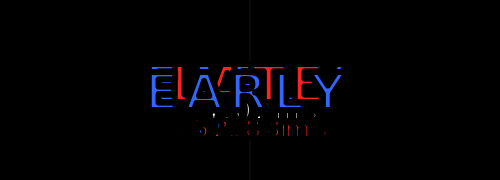

<div align="center">

#  Timing Feedback

**A real-time hit timing overlay for osu!  powered by [tosu](https://github.com/KotRikD/tosu)**


Shows **EARLY / LATE** judgements and exact **millisecond hit error** after every note hit.  
Works as an in-game overlay or OBS browser source.

<br>



</div>

---

## Features

- **Auto timing windows**  calculates Perfect window from game mode + OD + mods automatically
- **Custom timing window**  override with your own ±ms value
- **Text or custom images**  use labels or your own transparent PNGs for Early/Late
- **Hit error display**  exact ms offset with configurable decimal places
- **Full color control**  separate colors for Early, Late, and Perfect
- **Flexible fonts**  system font, Google Goldman, or load your own `.ttf`
- **Text stroke**  thick black outline for readability on any background
- **Fade or snap**  smooth fade-out or instant disappear animation
- **Position offsets**  move judgement text and ms text independently (X/Y)
- **osu! Lazer support**  detects floating-point hit errors automatically

---

## Installation

1. **Download** this repository as a ZIP (or `git clone` it)
2. **Place** the folder inside your tosu `/static` directory
4. **Configure** settings to your preference (see below)
5. **Add** the overlay URL as a Browser Source in OBS, or use it as an in-game overlay

> **Tip:** Set the browser source to **500×250** with a transparent background for best results.

---

## Settings

<details>
<summary><b>Timing Window</b></summary>

| Setting | Default | Description |
|---|---|---|
| Use Custom Timing Window | `false` | Override auto OD-based calculation |
| Custom Perfect Window | `16 ms` | ±ms threshold to count as a Perfect hit |

</details>

<details>
<summary><b>Judgement Display</b></summary>

| Setting | Default | Description |
|---|---|---|
| Show Timing Judgement | `true` | Show/hide the Early/Late label |
| Early Text | `EARLY` | Label for early hits |
| Late Text | `LATE` | Label for late hits |
| Font Size | `32 px` | Size of the judgement label |
| Judgement X-Offset | `0 px` | Horizontal position adjustment |
| Judgement Y-Offset | `0 px` | Vertical position adjustment |

</details>

<details>
<summary><b>Custom Images</b></summary>

| Setting | Default | Description |
|---|---|---|
| Use Custom Images | `false` | Use PNG images instead of text labels |
| Early Image File | `early.png` | PNG file for early hits |
| Late Image File | `late.png` | PNG file for late hits |
| Custom Image Size | `32 px` | Height of the displayed image |

</details>

<details>
<summary><b>Hit Error (ms)</b></summary>

| Setting | Default | Description |
|---|---|---|
| Show Hit Error | `false` | Show exact ms offset (e.g. `+16.67ms`) |
| Hide Early/Late Hit Error | `false` | Hide ms for Early/Late, show only for Perfect |
| Show Perfect Hit Error | `false` | Show ms even on Perfect hits |
| Always Show Hit Error (0ms) | `false` | Keep `0ms` visible between hits |
| Hit Error Decimal Places | `2` | `0`  `16ms` · `1`  `16.6ms` · `2`  `16.67ms` |
| Hit Error Font Size | `32 px` | Size of the ms text |
| Hit Error X-Offset | `0 px` | Horizontal position of ms text |
| Hit Error Y-Offset | `0 px` | Vertical position of ms text |

</details>

<details>
<summary><b>Colors</b></summary>

| Setting | Default | Description |
|---|---|---|
| Early Color | `#0000ff` | Color for early hits |
| Late Color | `#ff0000` | Color for late hits |
| Perfect Color | `#ffffff` | Color for perfect hit ms text |

</details>

<details>
<summary><b>Font</b></summary>

| Setting | Default | Description |
|---|---|---|
| Font Name | `Verdana` | Any Windows-installed font name |
| Use Custom Font File | `false` | Load a font file from the plugin folder |
| Custom Font File Name | `font.ttf` | Filename of your custom font |

</details>

<details>
<summary><b>Text Stroke</b></summary>

| Setting | Default | Description |
|---|---|---|
| Use Text Stroke | `true` | Black outline around all text |
| Judgement Stroke Thickness | `2 px` | Outline width for Early/Late label |
| Hit Error Stroke Thickness | `2 px` | Outline width for ms text |

</details>

<details>
<summary><b>Animation</b></summary>

| Setting | Default | Description |
|---|---|---|
| Use Fade Out Animation | `false` | Fade out vs snap disappear |
| Show Duration | `400 ms` | How long judgement stays visible (no fade) |
| Fade Duration | `400 ms` | Duration of the fade-out animation |

</details>

---

## How It Works

tosu streams live game data over WebSocket. On each new hit, the overlay reads the latest entry from `hitErrors`, divides it by the current mod rate (e.g. DT = 1.5×), then compares the result against the Perfect window to decide which judgement to show.

### Timing Window Formula

| Mode | Formula |
|---|---|
| osu! standard | `80 - 6 × OD` |
| Taiko | `50 - 3 × OD` |
| Mania | `16` (fixed) |

> EZ halves OD · HR multiplies OD by 1.4 (capped at 10) before the formula is applied.

---

## File Structure

```
timing-feedback/
 index.html           # Overlay HTML
 main.css             # Styles & CSS variables
 main.js              # WebSocket logic & rendering
 settings.json        # Plugin settings (read by tosu)
 metadata.txt         # Plugin metadata
 early.png            # (optional) Custom early image
 late.png             # (optional) Custom late image
 font.ttf             # (optional) Custom font file
```

---

## Compatibility

| | |
|---|---|
| **Overlay tool** | [tosu](https://github.com/KotRikD/tosu) (WebSocket v2) |
| **Game modes** | osu! standard · Taiko · Mania |
| **Client** | Stable · Lazer |
| **Mods** | EZ · HR · DT / HT (rate-corrected) |
| **OBS** | Browser Source, 500×250, transparent |

---

## Credits

- **Author**  Albert
- **Based on**  [breadles](https://github.com/breadles5) original concept
- **Powered by**  [tosu](https://github.com/KotRikD/tosu) by KotRikD
